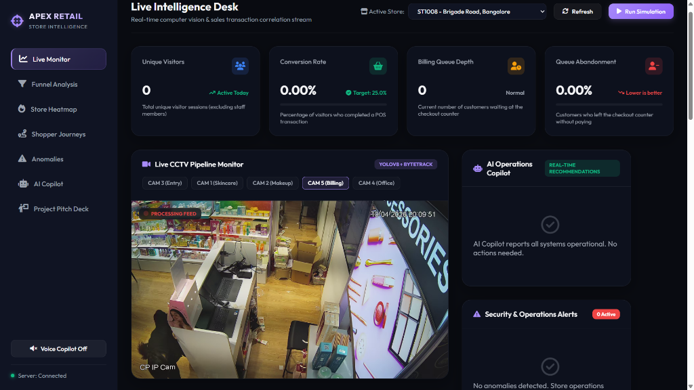
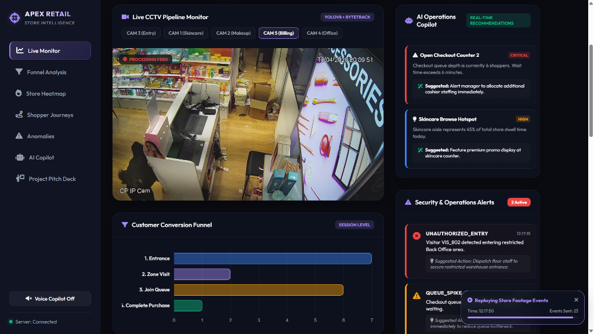
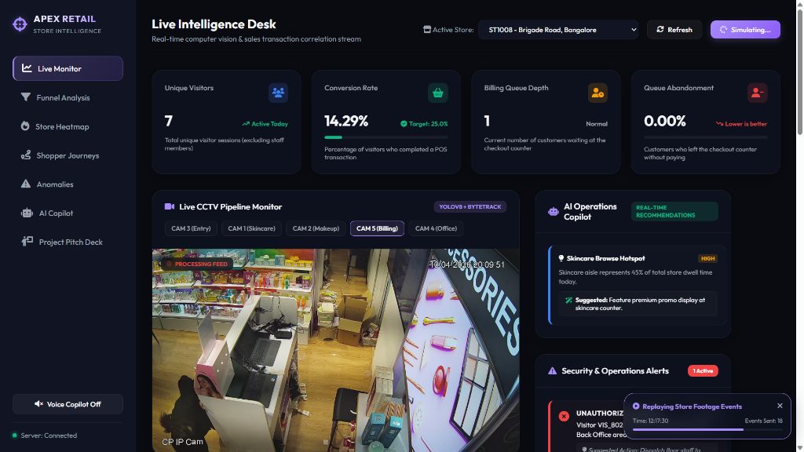
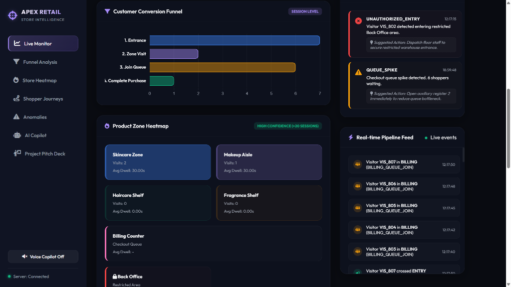
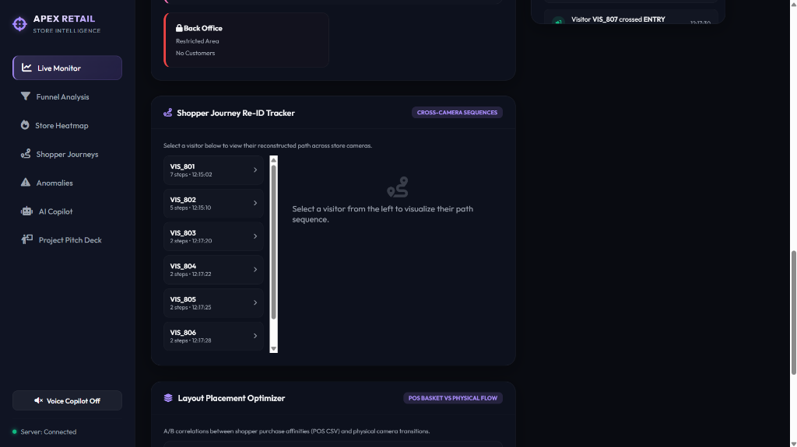

# Store Intelligence System (Apex Retail)

This repository contains the AI-powered Store Intelligence System built for the **Purplle Tech Challenge 2026**. It combines a real-time computer vision tracking pipeline, a FastAPI REST & WebSocket analytics backend, and a premium interactive dashboard interface.

👉 **[Live Interactive Dashboard Demo (GitHub Pages)](https://shahsuraj0204.github.io/store-intelligence/)**

---

## 🖥️ Dashboard Preview

Below are screenshots of the interactive dashboard demonstrating key system capabilities:

### 1. Live Intelligence Desk & Active CCTV Streams
The live desk shows real-time computer vision bounding boxes and shopper Re-ID tracking overlays on the store footage:


### 2. Conversion Funnel & Security Desk
Shows live-updating sales conversion funnel charts, AI operations copilot recommendations, and real-time security alerts (e.g. restricted warehouse entry):


### 3. Simulated Live Event Ingestion
Replaying live store footage events pushes WebSocket broadcasts, updating the KPI dashboard frame-by-frame:


### 4. Interactive Product Zone Heatmaps
Tracks visits, dwell times, and occupancy across Skincare, Makeup, Haircare, Fragrance, and Billing Zones:


### 5. Shopper Journey Re-ID Tracker
Reconstructs exact cross-camera sequence pathways for individual customer sessions to analyze conversion bottlenecks:


## 🚀 Quick Setup (5 Commands)

Process from cloning to running locally in exactly 5 steps:

```bash
# 1. Clone the repository and navigate inside
git clone https://github.com/shahsuraj0204/store-intelligence.git && cd store-intelligence

# 2. Start the FastAPI backend server
python -m uvicorn app.main:app --host 127.0.0.1 --port 8000

# 3. Initialize Python dependencies for local testing
pip install -r requirements.txt

# 4. Run the computer vision detection & tracking pipeline against the CCTV footage
python pipeline/detect.py --video_dir "CCTV Footage" --store_id "ST1008" --output "events_output.jsonl"

# 5. Run the automated test suite
python -m pytest tests/ -v
```

---

## 📡 Services & Ports

*   **Live Dashboard Web Surface**: Available at [http://localhost:8000/dashboard](http://localhost:8000/dashboard) (or redirects from [http://localhost:8000](http://localhost:8000)).
*   **FastAPI REST endpoints**: Exposed at `http://localhost:8000/docs` (Swagger UI).
*   **Real-time WebSocket stream**: Available at `ws://localhost:8000/events/stream`.

---

## 📹 Ingesting & Simulating Data

### Running the Batch Pipeline
To process the video clips and automatically ingest the behavioral events to the REST API, execute:
```bash
# Run detection tracking
python pipeline/detect.py --video_dir "CCTV Footage" --store_id "ST1008" --output "events_output.jsonl"

# Emit events to local server
python pipeline/emit.py --input "events_output.jsonl" --host "http://127.0.0.1:8000"
```

### Running Simulated Live Demo
To view the dashboard's live streaming, charts, and anomaly alerts instantly without running the CV processing:
1. Open the Live Dashboard at `http://localhost:8000` (or your public GitHub Pages link!)
2. Click the **"Run Simulation"** button in the top right corner.
3. The dashboard will automatically clear out the database and start a fresh, live event stream directly into the API, showing WebSockets, KPI cards, heatmaps, visitor lists, and chart widgets updating live frame-by-frame!

---

## 🛠️ Key Features Built
*   **Edge CV Tracking (YOLOv8 + ByteTrack)**: Human bounding-box detection mapped to physical store coordinate zones.
*   **Multi-Camera Spatial Re-ID**: Tracking customer pathways across camera overlaps and separating staff traffic from shoppers automatically.
*   **Live Metrics API**: Dwell times, conversion funnels, checkout queue depths, and queue abandonment rates computed dynamically.
*   **Dynamic Operations & Security Alerts**: Critical warnings for restricted area office breaches and cashier queue spikes.
*   **AI Layout Optimizer**: Correlating Point-of-Sale (POS) basket transitions with physical aisle flow to recommend layout modifications.
